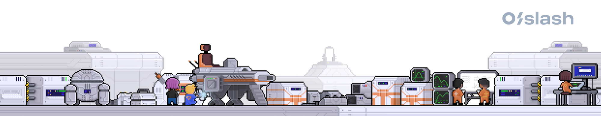
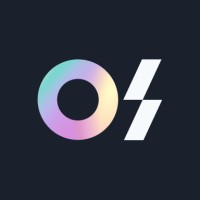

<!DOCTYPE html>
<html lang="en">
  <head>
    <meta charset="UTF-8" />
    <meta http-equiv="X-UA-Compatible" content="IE=edge" />
    <meta name="viewport" content="width=device-width, initial-scale=1.0" />
    <title>O/Slash</title>
    
  </head>
  <body>
    <section>
      

        
      

      

        

          
        

        

          <h2>OSlash - UI Developer Assignment</h2>
          
About OSlash

          <iframe
            src="https://www.youtube.com/embed/9EsVAlYA4LY?feature=oembed"
            frameborder="0"
            width="650"
            height="375"
            sandbox="allow-scripts allow-popups allow-top-navigation-by-user-activation allow-forms allow-same-origin"
          ></iframe>
          

            OSlash is looking to hire an experienced UI Developer to join our
            in-house team. If you love optimizing applications, ensuring UI/UX
            feasibility, and building beautiful user experiences, we’d love to
            have you be a part of our small team!
          

          

            <h2>Notion Share Widget</h2>
            

              Goal: To build a re-usable notion share widget component with
              plain CSS + any JavaScript Framework of your choice
            

            

              Starter: You can use one of vite’s starter kits or bring your own
              setup to showcase the widget
            

          

          

            <h2>Bonus Points</h2>
            <ul>
              <li>1. Use of Modern CSS features like flex & grid</li>
              <li>
                2. Focus on keyboard friendly navigation throughout the UI
              </li>
              <li>
                3. Taking full advantage of
                [Storybook](https://storybook.js.org/) & building interactive
                stories
              </li>
              <li>
                4. A neat writeup of the principles & ideas you followed for
                building the widget in the README
              </li>
            </ul>
            

              The component should be flexible enough to be used in any part of
              the Application without causing any issues with existing CSS.
            

          

          

            <h4>References:</h4>
            <ul>
              <li>
                Storybooks Showcase:
                <a href="https://storybook.js.org/showcase/" target="_blank">
                  https://storybook.js.org/showcase/</a
                >
              </li>
              <li>
                Refer the actual share widget in
                <a herf="https://www.notion.so/" target="_blank">notion.so</a>
              </li>
            </ul>
          

          

            <h4>⛳️ Expectations</h4>
            
The most important things we look for in your solution are —

            <ul>
              <li>Solving the main problem.</li>
              <li>
                Concise and useful documentation (including references, known
                issues, local development instructions, etc.).
              </li>
              <li>
                Frequent and
                <a
                  href="https://chris.beams.io/posts/git-commit/"
                  target="_blank"
                >
                  good commit messages.</a
                >
              </li>
              <li>
                Following good code quality principles – including building for
                extensibility.
              </li>
              <li>Unit and/or integration tests.</li>
            </ul>
          

          

            <h4>📦 Delivery</h4>
            

              Please include instructions to compile the apps and run them on
              our devices in your README.
            

            

              You can send us links to your solution at hiring@oslash.com. If
              you do not wish to host your code publicly, please bundle your Git
              repo and email it to us as an attachment.
            

          

          

            <h4>☎️ Contacts</h4>
            

              1. Talent Acquisition —
              <a
                href="https://www.linkedin.com/in/yogesh-sp-8503b878/"
                target="_blank"
              >
                Yogesh
              </a>
              -<a href="mailto:yogesh.sp@oslash.com"> yogesh.sp@oslash.com</a
                >,<a
                  href="tel:+91
              7812847071"
                >
                  +91 7812847071</a
                >
            

          

        

      

    </section>
  </body>
</html>
